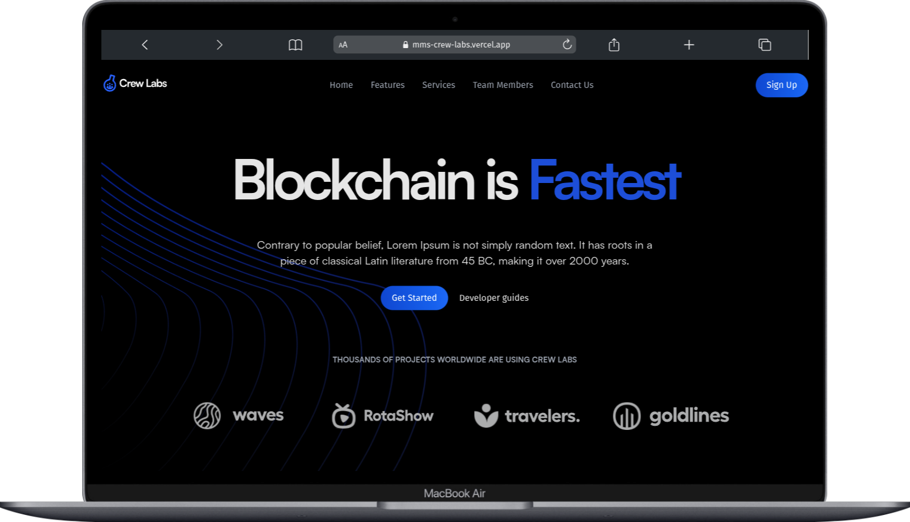

# Crew Labs Blockchain Landing Page

This is the clone landing page for **Crew Labs**, a company specializing in fast, secure, and collaborative blockchain technology solutions. The project serves as the main web presence, detailing our features, services, and team.

## 📦 Features

Crew Labs offers a suite of tools designed for efficiency and security in the blockchain space.

- **🚀 Fast Transactions:** Built on what we call the "Fastest Blockchain Technology."
- **🛡️ Protect Your Data:** Robust security and cryptography to keep your data safe.
- **🔍 Super Smart Search:** Quickly find what you need within your projects.
- **🤝 Work Better Together:** Tools like team channels and workflow builders enhance collaboration.
- **⚙️ Project Management:** Control everything in one centralized place.
- **💬 Live Customer Support:** Real-time help for questions, bug reports, and feedback.

## 🌍 Live Demo

> Click Here: [https://mms-crew-labs.vercel.app](https://mms-crew-labs.vercel.app)



## 🛠️ Tech Stack

This project is a modern web application built with a focus on performance and developer experience.

- **Framework:** [Next.js](https://nextjs.org/) 13
- **Library:** [React](https://reactjs.org/) 18
- **Styling:** [Tailwind CSS](https://tailwindcss.com/)
- **Animations:** [Animate.css](https://animate.style/)
- **Icons:** [React Icons](https://react-icons.github.io/react-icons/)
- **Contact Form:** [EmailJS](https://www.emailjs.com/)

## 🚀 Getting Started

To get a local copy up and running, follow these simple steps.

### Prerequisites

You'll need [Node.js](https://nodejs.org/en/) (version 16.x or later) and npm installed on your machine.

### Installation

1. Clone the repository:

   ```sh
   git clone https://github.com/maruf-pfc/crew-labs.git
   ```

2. Navigate to the project directory:

   ```sh
   cd crew-labs
   ```

3. Install NPM packages:

   ```sh
   npm install
   ```

### Running the Application

You can run the following scripts from the project's root directory:

- **Run the development server:**

  ```sh
  npm run dev
  ```

  Open [http://localhost:3000](https://www.google.com/search?q=http://localhost:3000) to view it in your browser.

- **Build for production:**

  ```sh
  npm run build
  ```

- **Run the production build:**

  ```sh
  npm run start
  ```

- **Run the linter:**

  ```sh
  npm run lint
  ```
